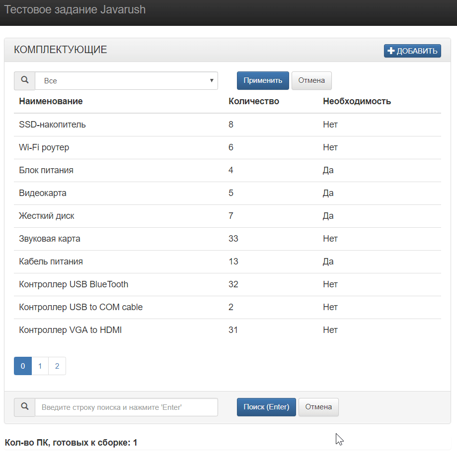

## Тестовое задание Javarush

**Первичная инициализация**

Не требуется, загрузка данных производится средствами Спринга на этапе запуска приложения
(schema-mysql.sql и data-mysql.sql).

Примечание : на MySQL сервере должна быть создана БД 'test'. При наличии в ней необходимой
таблицы (parts) , она будет удалена и пересоздана с новой "заливкой" данных.

Авторизация для доступа к БД - согл. заданию (root/root).

**Адресная строка для тестирования**

http://localhost:8080/

